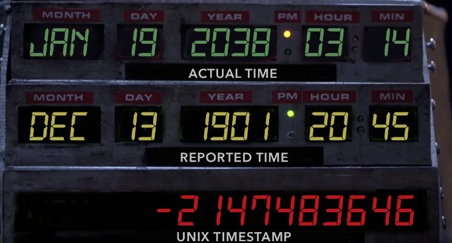

# BigInt
The maximum limit of Unsigned Long Int in C/C++ is 18446744073709551615, a 20 digit number. While languages like C++/Java support classes of BigIntegers (100 digit numbers). C by default has no such support. This project aims to bring that support to the C language along with basic arithmetic operations like Comparison, Addition, Subtraction and Multiplication along with applications such as Factorial, Fibonacci etc.

## Objective
Add support for Big Integers (numbers greater than 18446744073709551615) in C along with basic mathematical operations and functions.

## Applications
While practicing Competitive Programming or in most of the programming contests, you might have noticed that you are required to print the result in 10^9+7 modulo.  
Ever wondered WHY? :thinking:  
Because of **Integer Overflows.**  The largest integer datatype in C/C++ is _long long int_ and it can store integers from 2^(-63) to 2^(63). (~ 10^18). But, we might come across some cases where this range of _unsigned long long int_ will be insufficient to handle such big numbers. 
- Calculate factorial of very large integers.
- Calculate very large nth Fibonacci number.
- Calculate binomial coefficient of very large numbers.
- Greatest Common Divisor.
- Perform binary exponentiation on very large numbers or raise numbers to very large powers.

## Requirements
- You may assume all BigInts are at most 1000 digits long, hence using malloc function, declare a 1001 element character array. The 1 extra element will be for the null character '\0'.
- To avoid computing with garbage values, initialize all elements of the declared BigInt to 0.

## Motivation Behind this Project
- GANGNAM STYLE:  
    YouTube developers built their platform with a counter using a signed 32-bit integer.  
    &emsp; &emsp; &emsp; &emsp; &emsp; 2^(31) - 1 = 2147483647  
    This means the maximum possible views could 2,147,483,647. (~ 2.1 billion).  

    Gangnam Style breached the barrier, showing more than 2.1 billion views & we got some arbitrary result. 
    
    
    
    To solve this, YouTube upgraded to 64-bit integer for its video counter, which means videos have a maximum viewer count of 9,223,372,036,854,776,000. (~ 9.22 quintillion).  
    &emsp; &emsp; &emsp; &emsp; &emsp; 2^(63) - 1 = 9223372036854776000

    
    
- UNIX EPOCH TIME:  
    Unix systems record time values as the number of seconds since 00:00:00 UTC on January 1, 1970. 32-bit systems use a signed 32-bit integer for this, so they will wrap around 2,147,483,647 seconds after that date. Two billion seconds is about 68 years; on January 19, 2038, at 03:14:07 in the morning, 32-bit Unix clocks will roll over. One second past that is a time counter overflow, which results in the time flying 137 years into the past, because the time counter becomes -2,147,483,648. Unix machines are eventually going to run out of the bits to tick off seconds. So, on that day, the C programs that use the standard time library will start to have problems with dates.  
    This Year 2038 Problem is also called Unix Millenium Bug or Y2K38 bug.

    

    Here’s an animation showing how the Year 2038 bug would reset the date:

    