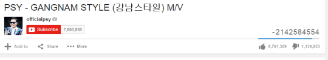
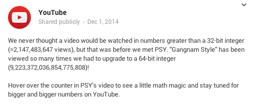

# BigInt
The maximum limit of Unsigned Long Int in C/C++ is 18446744073709551615, a 20 digit number. While languages like C++/Java support classes of BigIntegers (100 digit numbers). C by default has no such support. This project aims to bring that support to the C language along with basic arithmetic operations like Comparison, Addition, Subtraction and Multiplication along with applications such as Factorial, Fibonacci etc.

## Objective
Add support for Big Integers (numbers greater than 18446744073709551615) in C along with basic mathematical operations and functions.

## Applications
- Calculate factorial of very large integers.
- Calculate very large nth Fibonacci number.
- Calculate binomial coefficient of very large numbers.
- Perform binary exponentiation on very large numbers or raise numbers to very large powers.
- Greatest Common Divisor.

## Requirements
- You may assume all INTALs are at most 1000 digits long, hence using malloc function, declare a 1001 element character array. The 1 extra element will be for the null character '\0'.
- To avoid computing with garbage values, initialize all elements of the declared INTAL to 0.

## Motivation Behind this Project
- GANGNAM STYLE:  
    YouTube developers built their platform with a counter using a signed 32-bit integer.  
    &emsp; &emsp; &emsp; &emsp; &emsp; 2^(31) - 1 = 2147483647  
    This means the maximum possible views could 2,147,483,647. (~ 2.1 billion).  

    Gangnam Style breached the barrier, showing more than 2.1 billion views & we got some arbitrary result. 
    
    
    
    To solve this, YouTube upgraded to 64-bit integer for its video counter, which means videos have a maximum viewer count of 9,223,372,036,854,776,000. (~ 9.22 quintillion).  
    &emsp; &emsp; &emsp; &emsp; &emsp; 2^(63) - 1 = 9223372036854776000

     